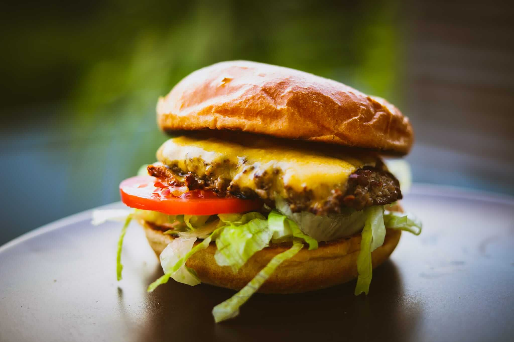

<!-- section -->
## Ingrédients  

### Pour 4 burgers  

- **4** pains à burger  
- **680 g** de viande hachée de bœuf  
- **8** tranches de cheddar  
- **1** tomate  
- **4 cuillères à soupe** de beurre clarifié  
- Sel  
- **1/4** de laitue iceberg  

### Pour la sauce  

- **120 ml** de mayonnaise  
- **1/2** oignon  
- **1 cuillère à café** de sauce Worcestershire  
- **2 cuillères à café** de sauce chili  
- **1 cuillère à soupe** de moutarde  

<!-- section -->
## Préparation  

### Préparation  

- Diviser la viande hachée en 8 parts égales (environ 85 g chacune) et former des boulettes rondes. Placer les boulettes au réfrigérateur.  
- Émincer finement la laitue iceberg.  
- Couper la tomate en 8 tranches fines (*Astuce : couper en gardant le pédoncule sur le côté*).  
- Râper ou hacher l’oignon le plus finement possible.  

### Sauce  

Mélanger l’oignon râpé avec tous les autres ingrédients pour la sauce jusqu’à obtenir une consistance homogène.  

### Faire griller les pains  

Faire chauffer le beurre clarifié dans une poêle à feu moyen et y faire griller les pains à burger jusqu’à ce qu’ils soient dorés.  

### Cuisson de la viande  

Augmenter la chaleur de la poêle et y déposer les boulettes de viande (sans huile ni matière grasse supplémentaire). Aplatir fortement les boulettes avec une spatule. Saler, poivrer le dessus, et ajouter une petite cuillère de sauce. Lorsque la face inférieure est bien dorée, retourner la boulette. Avant la fin de la cuisson, poser une tranche de cheddar sur chaque boulette. Une fois cuites, superposer deux boulettes, le fromage servant de "colle".  

### Montage du burger  

Étaler un peu de sauce sur la base du pain. Ajouter la laitue, deux tranches de tomate, puis le double steak avec le cheddar fondu. Placer le chapeau du pain pour fermer le burger. Positionner les légumes sous la viande pour plus de stabilité et une meilleure prise en main.  

*Recette originale : [Better Than Fast Food! Classic Smash Burger Recipe](https://youtu.be/foD42-73wdI)*  
